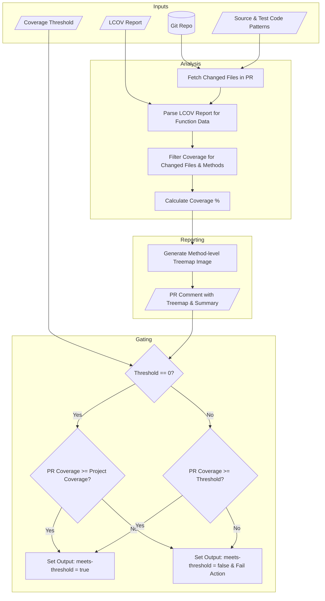

# Coverage Treemap Action

A GitHub Action that analyzes code coverage for files changed in a pull
request, generates a visual treemap of test gaps, and enforces a coverage
threshold.


## Overview

This action provides clear, visual feedback on the test coverage of new code
introduced in a pull request. It helps maintain code quality by:

1. **Parsing LCOV:** Consumes the `lcov.info` file generated by your test
   suite.
2. **Focusing on the Diff:** It only analyzes coverage for the files that have
   been added or modified in the current pull request, ignoring unchanged code.
3. **Visualizing Gaps:** Generates a treemap image where each block represents
   a **function or method** within the changed files. The size of the block
   corresponds to the method's line count, and the color indicates its test
   coverage (e.g., green for covered, red for uncovered).
4. **Commenting on PRs:** Posts a comment directly on the pull request,
   embedding the treemap image and a summary of the coverage results.
5. **Enforcing Quality Gates:** Fails the workflow run if the overall line
   coverage for the changed files falls below a specified threshold.

This targeted, granular approach ensures that developers can quickly pinpoint
and address uncovered methods in their new contributions.

## Features

### PR Comment Integration

The action automatically posts a comprehensive coverage report as a PR comment, including:

  - **Total Coverage**: Overall coverage percentage for all executed tests
  - **Changed Files Coverage**: Coverage percentage specifically for files modified in the PR
  - **Coverage Difference**: Comparison between total coverage and changed files coverage
  - **Detailed Breakdown**: File-by-file coverage analysis for changed files

#### Comment Management

  - **Smart Updates**: The action checks for existing comments and updates them instead of creating duplicates
  - **Multi-Label Support**: Use the optional `label` input to run multiple instances of this action in the same PR
    - Without label: Comment title is "Coveragemap Action"
    - With label: Comment title is "Coveragemap Action: \<label\>"
  - **Automatic Detection**: The action identifies and updates comments based on the title pattern

### File Pattern Filtering

The action supports file filtering using glob patterns to control which files are included in coverage analysis:

  - Use `source-code-pattern` to specify which files to **include in coverage** analysis.
  - Use `test-code-pattern` to specify which files to **exclude from coverage** analysis.

#### Pattern Examples

**Include only TypeScript files in src/ directory:**

```yaml
source-code-pattern: "src/**/*.ts"
```

**Exclude integration tests and mocks:**

```yaml
test-code-pattern: "**/integration/**,**/*.mock.*"
```

**Multi-language project:**

```yaml
source-code-pattern: "frontend/**/*.ts,backend/**/*.py,mobile/**/*.swift"
test-code-pattern: "**/*.test.*,**/*.spec.*,**/test_*"
```

#### Pattern Matching Details

File patterns are powered by [picomatch](https://github.com/micromatch/picomatch). Check the instructions to find more information about supported [globbing features](https://github.com/micromatch/picomatch?tab=readme-ov-file#globbing-features).

Multiple patterns can be specified by separating them with commas. Each file is included if it matches any source pattern, excluded if it matches any test pattern!

## Inputs

| Name                   | Type     | Required | Default                | Description                                                                                                           |
| :--------------------- | :------- | :------- | :--------------------- | :-------------------------------------------------------------------------------------------------------------------- |
| `lcov-file`            | `string` | `true`   | `'coverage/lcov.info'` | Path to the lcov.info report                                                                                         |
| `coverage-threshold`   | `string` | `true`   | `'80'`                 | Min coverage % for changed files. Set to '0' to compare PR coverage against overall project coverage instead.      |
| `github-token`         | `string` | `true`   | -                      | GitHub token to post PR comments                                                                                     |
| `label`                | `string` | `false`  | -                      | Optional label for comment identification                                                                             |
| `source-code-pattern`  | `string` | `false`  | -                      | Optional glob pattern(s) for source code files to include in coverage analysis. Multiple patterns separated by commas. |
| `test-code-pattern`    | `string` | `false`  | -                      | Optional glob pattern(s) for test files to exclude from coverage analysis. Multiple patterns separated by commas.   |

## Coverage Threshold Gating

The action includes sophisticated threshold gating to enforce coverage standards:

### Standard Threshold Mode (threshold > 0)

When `coverage-threshold` is set to a value greater than 0, the action enforces that the coverage percentage of changed files meets this threshold:

  - ✅ **Pass**: If PR changes have coverage ≥ threshold
  - ❌ **Fail**: If PR changes have coverage < threshold

Example: With `coverage-threshold: 80`, the action passes only if changed files have ≥80% coverage.

### Project Baseline Mode (threshold = 0)

When `coverage-threshold` is set to `"0"`, the action compares PR coverage against the overall project coverage:

  - ✅ **Pass**: If PR changes have coverage ≥ overall project coverage
  - ❌ **Fail**: If PR changes have coverage < overall project coverage

This mode ensures new code doesn't lower the overall quality bar while allowing flexibility for projects with varying coverage levels.

## Outputs

| Name                | Type      | Description                                      |
| :------------------ | :-------- | :----------------------------------------------- |
| `coverage-percentage` | `string` | The overall coverage percentage for changed files |
| `meets-threshold`   | `boolean` | True if coverage threshold is met               |
| `files-analyzed`    | `string`  | The number of changed files that were analyzed  |
| `files-with-coverage` | `string` | The number of changed files that have coverage data |

## Workflow Logic



## Checkout Behavior

This action needs to calculate the changeset for the PR and therefore won't work with shallow clones. Set `fetch-depth: 0` or use the following snippet
to calculate the minimal fetch depth required:

```yaml
    - name: Determine fetch depth
      id: base-depth
      run: echo "base-depth=$(expr ${{ github.event.pull_request.commits }} + 1)" | tee -a $GITHUB_OUTPUT

    - name: Checkout
      uses: actions/checkout@08c6903cd8c0fde910a37f88322edcfb5dd907a8 # v5.0.0
      with:
        fetch-depth: ${{ steps.base-depth.outputs.base-depth }}
```

## Example Usage

Here's how you would integrate this action into your CI workflow. It should run
after your tests and coverage report have been generated.

```yaml
name: "PR Coverage Check"

on:
  pull_request:
    branches:
      - main

permissions:
  contents: read
  pull-requests: write # Required to post comments

jobs:
  build-and-test:
    name: "Build, Test and Check Coverage"
    runs-on: ubuntu-latest
    steps:
      - name: Determine fetch depth
        id: base-depth
        run: echo "base-depth=$(expr ${{ github.event.pull_request.commits }} + 1)" | tee -a $GITHUB_OUTPUT

      - name: Checkout
        uses: actions/checkout@v5
        with:
          fetch-depth: ${{ steps.base-depth.outputs.base-depth }}

      - name: "Setup Node.js"
        uses: actions/setup-node@v4
        with:
          node-version: "18"
          cache: "npm"

      - name: "Install dependencies"
        run: npm install

      # This step generates the lcov.info file
      - name: "Run tests and generate coverage"
        run: npm run test -- --no-watch --code-coverage

      - name: "Coverage Treemap Action"
        id: coverage_check
        uses: your-username/coverage-treemap-action@v1
        with:
          lcov-file: "./coverage/your-project-name/lcov.info"
          coverage-threshold: 85
          github-token: ${{ secrets.GITHUB_TOKEN }}

      - name: "Check Coverage Output"
        if: steps.coverage_check.outputs.meets-threshold == 'false'
        run: |
          echo "Coverage check failed. See the PR comment for details."
          exit 1
```

### Example with Multiple Coverage Checks

If you need to run multiple coverage checks (e.g., for different test suites), use the `label` input to distinguish between them:

```yaml
      # Frontend coverage check
      - name: "Frontend Coverage Check"
        uses: your-username/coverage-treemap-action@v1
        with:
          lcov-file: "./coverage/frontend/lcov.info"
          coverage-threshold: 80
          github-token: ${{ secrets.GITHUB_TOKEN }}
          label: "Frontend"

      # Backend coverage check
      - name: "Backend Coverage Check"
        uses: your-username/coverage-treemap-action@v1
        with:
          lcov-file: "./coverage/backend/lcov.info"
          coverage-threshold: 85
          github-token: ${{ secrets.GITHUB_TOKEN }}
          label: "Backend"
```

### Example with Project Baseline Mode

For projects where you want to ensure new code maintains or improves the overall coverage level:

```yaml
      - name: "Coverage Baseline Check"
        uses: your-username/coverage-treemap-action@v1
        with:
          lcov-file: "./coverage/lcov.info"
          coverage-threshold: "0"  # Compare against project average
          github-token: ${{ secrets.GITHUB_TOKEN }}
          label: "Quality Gate"
```
