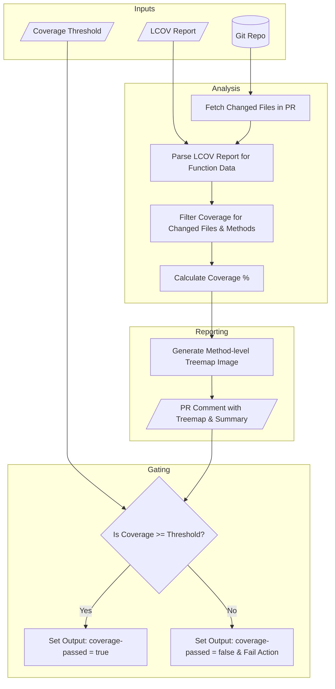

# Coverage Treemap Action

A GitHub Action that analyzes code coverage for files changed in a pull
request, generates a visual treemap of test gaps, and enforces a coverage
threshold.

## Overview

This action provides clear, visual feedback on the test coverage of new code
introduced in a pull request. It helps maintain code quality by:

1. **Parsing LCOV:** Consumes the `lcov.info` file generated by your test
   suite.
2. **Focusing on the Diff:** It only analyzes coverage for the files that have
   been added or modified in the current pull request, ignoring unchanged code.
3. **Visualizing Gaps:** Generates a treemap image where each block represents
   a **function or method** within the changed files. The size of the block
   corresponds to the method's line count, and the color indicates its test
   coverage (e.g., green for covered, red for uncovered).
4. **Commenting on PRs:** Posts a comment directly on the pull request,
   embedding the treemap image and a summary of the coverage results.
5. **Enforcing Quality Gates:** Fails the workflow run if the overall line
   coverage for the changed files falls below a specified threshold.

This targeted, granular approach ensures that developers can quickly pinpoint
and address uncovered methods in their new contributions.

## Inputs

| Name                 | Type     | Required | Default                | Description                       |
| :------------------- | :------- | :------- | :--------------------- | :-------------------------------- |
| `lcov-file`          | `string` | `true`   | `'coverage/lcov.info'` | Path to the lcov.info report     |
| `coverage-threshold` | `string` | `true`   | `'80'`                 | Min coverage % for changed files |

## Outputs

| Name              | Type      | Description                             |
| :---------------- | :-------- | :-------------------------------------- |
| `coverage-passed` | `boolean` | True if coverage threshold is met       |

## Workflow Logic



## Example Usage

Here's how you would integrate this action into your CI workflow. It should run
after your tests and coverage report have been generated.

```yaml
name: "PR Coverage Check"

on:
  pull_request:
    branches:
      - main

permissions:
  contents: read
  pull-requests: write # Required to post comments

jobs:
  build-and-test:
    name: "Build, Test and Check Coverage"
    runs-on: ubuntu-latest
    steps:
      - name: "Checkout code"
        uses: actions/checkout@v4

      - name: "Setup Node.js"
        uses: actions/setup-node@v4
        with:
          node-version: "18"
          cache: "npm"

      - name: "Install dependencies"
        run: npm install

      # This step generates the lcov.info file
      - name: "Run tests and generate coverage"
        run: npm run test -- --no-watch --code-coverage

      - name: "Coverage Treemap Action"
        id: coverage_check
        uses: your-username/coverage-treemap-action@v1
        with:
          lcov-file: "./coverage/your-project-name/lcov.info"
          coverage-threshold: 85
          github-token: ${{ secrets.GITHUB_TOKEN }}

      - name: "Check Coverage Output"
        if: steps.coverage_check.outputs.coverage-passed == 'false'
        run: |
          echo "Coverage check failed. See the PR comment for details."
          exit 1
```
