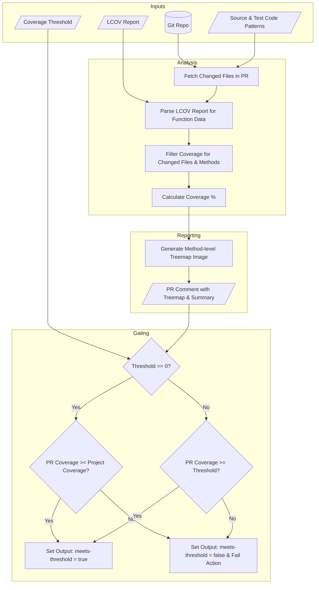

# Coverage Treemap Action

A GitHub Action that analyzes code coverage for files changed in a pull
request, generates a visual treemap of test gaps, and enforces a coverage
threshold.


## Overview

This action provides clear, visual feedback on the test coverage of new code
introduced in a pull request. It helps maintain code quality by:

1. **Parsing LCOV:** Consumes the `lcov.info` file generated by your test
   suite.
2. **Focusing on the Diff:** It only analyzes coverage for the files that have
   been added or modified in the current pull request, ignoring unchanged code.
3. **Visualizing Gaps:** Generates a treemap image where each block represents
   a **function or method** within the changed files. The size of the block
   corresponds to the method's line count, and the color indicates its test
   coverage (e.g., green for covered, red for uncovered).
4. **Commenting on PRs:** Posts a comment directly on the pull request,
   embedding the treemap image and a summary of the coverage results.
5. **Inline Annotations:** When GitHub App credentials are provided, posts up to 50
   targeted annotations highlighting uncovered lines and functions using the GitHub Checks API.
6. **Enforcing Quality Gates:** Fails the workflow run if the overall line
   coverage for the changed files falls below a specified threshold.

This targeted, granular approach ensures that developers can quickly pinpoint
and address uncovered methods in their new contributions.

## Features

### PR Comment Integration

The action automatically posts a comprehensive coverage report as a PR comment, including:

  - **Total Coverage**: Overall coverage percentage for all executed tests
  - **Changed Files Coverage**: Coverage percentage specifically for files modified in the PR
  - **Coverage Difference**: Comparison between total coverage and changed files coverage
  - **Detailed Breakdown**: File-by-file coverage analysis for changed files

#### Comment Management

  - **Smart Updates**: The action checks for existing comments and updates them instead of creating duplicates
  - **Multi-Label Support**: Use the optional `label` input to run multiple instances of this action in the same PR
    - Without label: Comment title is "Coveragemap Action"
    - With label: Comment title is "Coveragemap Action: \<label\>"
  - **Automatic Detection**: The action identifies and updates comments based on the title pattern

### File Pattern Filtering

The action supports file filtering using glob patterns to control which files are included in coverage analysis:

  - Use `source-code-pattern` to specify which files to **include in coverage** analysis.
  - Use `test-code-pattern` to specify which files to **exclude from coverage** analysis.

#### Pattern Examples

**Include only TypeScript files in src/ directory:**

```yaml
source-code-pattern: "src/**/*.ts"
```

**Exclude integration tests and mocks:**

```yaml
test-code-pattern: "**/integration/**,**/*.mock.*"
```

### GitHub Checks API Integration

When GitHub App credentials are provided, the action automatically posts detailed annotations directly to the PR using the GitHub Checks API:

  - **Smart Annotations**: Up to 50 targeted annotations highlighting uncovered lines and functions
  - **Grouped Coverage Issues**: Consecutive uncovered lines are grouped for better readability
  - **Coverage Artifacts**: Creates an `annotations.json` artifact containing all coverage annotations
  - **Check Run Integration**: Posts a dedicated check run with coverage summary and annotations

#### Setup Requirements

To enable GitHub Checks API integration:

1. **Create a GitHub App** with `checks:write` permission
2. **Install the app** on your repository
3. **Configure secrets** in your repository:
   - `COVERAGEMAP_APP_ID`: Your GitHub App's ID
   - `COVERAGEMAP_APP_PRIVATE_KEY`: Your GitHub App's Private Key

#### Annotation Features

  - **Uncovered Lines**: Highlights lines not covered by tests with warning annotations
  - **Uncovered Functions**: Marks functions without test coverage
  - **File-Level Summaries**: Provides coverage summaries for files with low coverage
  - **Smart Prioritization**: Shows highest priority annotations when limit is exceeded

#### Permissions Required

Your workflow needs the `checks: write` permission:

```yaml
permissions:
  contents: read
  pull-requests: write
  checks: write  # Required for GitHub Checks API
```

**Multi-language project:**

```yaml
source-code-pattern: "frontend/**/*.ts,backend/**/*.py,mobile/**/*.swift"
test-code-pattern: "**/*.test.*,**/*.spec.*,**/test_*"
```

#### Pattern Matching Details

File patterns are powered by [picomatch](https://github.com/micromatch/picomatch). Check the instructions to find more information about supported [globbing features](https://github.com/micromatch/picomatch?tab=readme-ov-file#globbing-features).

Multiple patterns can be specified by separating them with commas. Each file is included if it matches any source pattern, excluded if it matches any test pattern!

## Inputs

| Name                   | Type     | Required | Default                | Description                                                                                                           |
| :--------------------- | :------- | :------- | :--------------------- | :-------------------------------------------------------------------------------------------------------------------- |
| `lcov-file`            | `string` | `true`   | `'coverage/lcov.info'` | Path to the lcov.info report                                                                                         |
| `coverage-threshold`   | `string` | `false`  | `'80'`                 | Min coverage % for changed files. Only used when `gate-mode` is `threshold`.                                       |
| `gate-mode`            | `string` | `false`  | `'threshold'`          | How to gate the workflow: `threshold` (fail below `coverage-threshold`), `baseline` (fail below overall project coverage), or `none` (never fail; report only). |
| `github-token`         | `string` | `true`   | -                      | GitHub token to post PR comments                                                                                     |
| `target-branch`        | `string` | `false`  | `'main'`               | Branch the PR targets. Used only for labelling/reporting; the diff base is derived from the PR event (see [Changeset Detection](#changeset-detection)). |
| `label`                | `string` | `false`  | -                      | Optional label for comment identification                                                                             |
| `source-code-pattern`  | `string` | `false`  | -                      | Optional glob pattern(s) for source code files to include in coverage analysis. Multiple patterns separated by commas. |
| `test-code-pattern`    | `string` | `false`  | -                      | Optional glob pattern(s) for test files to exclude from coverage analysis. Multiple patterns separated by commas.   |
| `github-app-id` | `string` | `false`  | -                      | GitHub App ID for posting check annotations. When provided with `github-app-private-key`, enables GitHub Checks API annotations. |
| `github-app-private-key` | `string` | `false`  | -                   | GitHub App Private Key for posting check annotations. When provided with `github-app-id`, enables GitHub Checks API annotations. |

## Coverage Threshold Gating

The action includes sophisticated threshold gating to enforce coverage standards. The gating behavior is selected with the `gate-mode` input.

### Standard Threshold Mode (`gate-mode: threshold`, default)

The action enforces that the coverage percentage of changed files meets `coverage-threshold`:

  - ✅ **Pass**: If PR changes have coverage ≥ threshold
  - ❌ **Fail**: If PR changes have coverage < threshold

Example: With `coverage-threshold: 80`, the action passes only if changed files have ≥80% coverage.

### Project Baseline Mode (`gate-mode: baseline`)

The action compares PR coverage against the overall project coverage:

  - ✅ **Pass**: If PR changes have coverage ≥ overall project coverage
  - ❌ **Fail**: If PR changes have coverage < overall project coverage

This mode ensures new code doesn't lower the overall quality bar while allowing flexibility for projects with varying coverage levels.

### Disabled Mode (`gate-mode: none`)

The action measures and reports coverage but never fails the workflow. Use this to surface the treemap and PR comment without enforcing a gate, instead of having the caller workflow flag the step to ignore failures.

  - ℹ️ **Always passes**: `meets-threshold` is reported as `true` and the PR comment shows a "Gating disabled" note.

## Outputs

| Name                | Type      | Description                                      |
| :------------------ | :-------- | :----------------------------------------------- |
| `coverage-percentage` | `string` | The overall coverage percentage for changed files |
| `meets-threshold`   | `boolean` | True if coverage threshold is met               |
| `files-analyzed`    | `string`  | The number of changed files that were analyzed  |
| `files-with-coverage` | `string` | The number of changed files that have coverage data |

## Workflow Logic


```mermaid
flowchart TD
  subgraph Inputs
    A1[/LCOV Report/]
    A2[/Coverage Threshold/]
    A3[(Git Repo)]
    A4[/Source & Test Code Patterns/]
  end

  subgraph Analysis
    B[Fetch Changed Files in PR]
    C[Parse LCOV Report for Function Data]
    D[Filter Coverage for Changed Files & Methods]
    E[Calculate Coverage %]
  end

  subgraph Reporting
    F[Generate Method-level Treemap Image]
    G[/PR Comment with Treemap & Summary/]
  end

  subgraph Gating
    H{PR Coverage >= Threshold?}
    H1{Threshold == 0?}
    H2{PR Coverage >= Project Coverage?}
    I[Set Output: meets-threshold = true]
    J[Set Output: meets-threshold = false & Fail Action]
  end

  A1 --> C
  A2 --> H1
  A3 --> B
  A4 --> B
  B --> C --> D --> E --> F --> G --> H1
  H1 -- Yes --> H2
  H1 -- No --> H
  H2 -- Yes --> I
  H2 -- No --> J
  H -- Yes --> I
  H -- No --> J
```

## Changeset Detection

The action analyses only the files your pull request actually changed. To do
this reliably it determines the **merge base** — the most recent common
ancestor — between the PR head and the PR base, then diffs from there:

```text
git merge-base <pr-base-sha> <pr-head-sha>   # the branch point
git diff --name-only --diff-filter=AM <merge-base>..<pr-head-sha>
```

This is equivalent to git's three-dot `base...head` notation and matters when
the target branch has **diverged** since the PR branched off. A plain two-dot
`base..head` diff would incorrectly attribute commits that landed on the target
branch (after the branch point) to your PR, inflating the changeset with files
you never touched. Comparing against the merge base isolates the PR's own
changes regardless of how far the target branch has advanced.

The base and head SHAs come from the `pull_request` event payload
(`pull_request.base.sha` / `pull_request.head.sha`), which is the most reliable
source during a `pull_request` workflow. The `target-branch` input does **not**
influence this calculation — on a `pull_request` event `pull_request.base.sha`
already points at the target branch tip. `target-branch` is used purely for
labelling and reporting (e.g. the changeset summary and the `target-branch`
output).

Only added (`A`) and modified (`M`) files are considered; deletions are
excluded since there is nothing to measure coverage for.

## Checkout Behavior

Because the action computes a merge base, the local clone must contain enough
history to reach the branch point. A default shallow checkout (`fetch-depth: 1`)
usually does **not**. Set `fetch-depth: 0` for a full clone, or use the snippet
below to fetch just enough history — the PR's own commits plus the one parent
that is the branch point:

```yaml
    - name: Determine fetch depth
      id: base-depth
      run: echo "base-depth=$(expr ${{ github.event.pull_request.commits }} + 1)" | tee -a $GITHUB_OUTPUT

    - name: Checkout
      uses: actions/checkout@08c6903cd8c0fde910a37f88322edcfb5dd907a8 # v5.0.0
      with:
        fetch-depth: ${{ steps.base-depth.outputs.base-depth }}
```

If the merge base cannot be resolved (for example the clone is still too
shallow), the action logs a warning and falls back to diffing against the PR
base SHA directly. This preserves a result rather than failing, but the
changeset may include unrelated target-branch changes when the branch has
diverged — increase `fetch-depth` to restore accurate detection.

## Example Usage

Here's how you would integrate this action into your CI workflow. It should run
after your tests and coverage report have been generated.

```yaml
name: "PR Coverage Check"

on:
  pull_request:
    branches:
      - main

permissions:
  contents: read
  pull-requests: write # Required to post comments
  checks: write # Required for GitHub Checks API annotations

jobs:
  build-and-test:
    name: "Build, Test and Check Coverage"
    runs-on: ubuntu-latest
    steps:
      - name: Determine fetch depth
        id: base-depth
        run: echo "base-depth=$(expr ${{ github.event.pull_request.commits }} + 1)" | tee -a $GITHUB_OUTPUT

      - name: Checkout
        uses: actions/checkout@93cb6efe18208431cddfb8368fd83d5badbf9bfd # v5.0.1
        with:
          fetch-depth: ${{ steps.base-depth.outputs.base-depth }}

      - name: "Setup Node.js"
        uses: actions/setup-node@48b55a011bda9f5d6aeb4c2d9c7362e8dae4041e # v6.4.0
        with:
          node-version: "18"
          cache: "npm"

      - name: "Install dependencies"
        run: npm install

      # This step generates the lcov.info file
      - name: "Run tests and generate coverage"
        run: npm run test -- --no-watch --code-coverage

      # Pinning to a full commit SHA (rather than a tag like @v1) is recommended
      # for stronger supply-chain security. Find the SHA on the release page.
      - name: "Coverage Treemap Action"
        id: coverage_check
        uses: maxbirkner/coveragemap@v1
        with:
          lcov-file: "./coverage/your-project-name/lcov.info"
          coverage-threshold: 85
          github-token: ${{ secrets.GITHUB_TOKEN }}
          # Optional: Enable GitHub Checks API annotations
          github-app-id: ${{ secrets.COVERAGEMAP_APP_ID }}
          github-app-private-key: ${{ secrets.COVERAGEMAP_APP_PRIVATE_KEY }}

      - name: "Check Coverage Output"
        if: steps.coverage_check.outputs.meets-threshold == 'false'
        run: |
          echo "Coverage check failed. See the PR comment for details."
          exit 1
```

### Example with Multiple Coverage Checks

If you need to run multiple coverage checks (e.g., for different test suites), use the `label` input to distinguish between them:

```yaml
      # Frontend coverage check
      - name: "Frontend Coverage Check"
        uses: maxbirkner/coveragemap@v1
        with:
          lcov-file: "./coverage/frontend/lcov.info"
          coverage-threshold: 80
          github-token: ${{ secrets.GITHUB_TOKEN }}
          label: "Frontend"

      # Backend coverage check
      - name: "Backend Coverage Check"
        uses: maxbirkner/coveragemap@v1
        with:
          lcov-file: "./coverage/backend/lcov.info"
          coverage-threshold: 85
          github-token: ${{ secrets.GITHUB_TOKEN }}
          label: "Backend"
```

### Example with Project Baseline Mode

For projects where you want to ensure new code maintains or improves the overall coverage level:

```yaml
      - name: "Coverage Baseline Check"
        uses: maxbirkner/coveragemap@v1
        with:
          lcov-file: "./coverage/lcov.info"
          coverage-threshold: "0"  # Compare against project average
          github-token: ${{ secrets.GITHUB_TOKEN }}
          label: "Quality Gate"
```

## Privacy

This action runs entirely inside your own GitHub Actions runner. It does not
collect, transmit, or share your data with the maintainer or any third party,
and it contains no telemetry or analytics. See [PRIVACY.md](PRIVACY.md) for
details.

## Support

This is a free, open-source hobby project. Please report bugs and ask questions
via [GitHub Issues](https://github.com/maxbirkner/coveragemap/issues). See
[SUPPORT.md](SUPPORT.md) for what to include. For security reports, see
[SECURITY.md](SECURITY.md).

## Disclaimer

This software is provided **"AS IS"**, without warranty of any kind, express or
implied, including but not limited to the warranties of merchantability, fitness
for a particular purpose, and noninfringement. In no event shall the authors or
copyright holders be liable for any claim, damages, or other liability, whether
in an action of contract, tort, or otherwise, arising from, out of, or in
connection with the software or the use or other dealings in the software.

You are responsible for reviewing the action and pinning it to a specific
version or commit SHA before using it in your workflows. See the
[LICENSE](LICENSE) file for the full terms.

## License

This project is licensed under the [MIT License](LICENSE).
